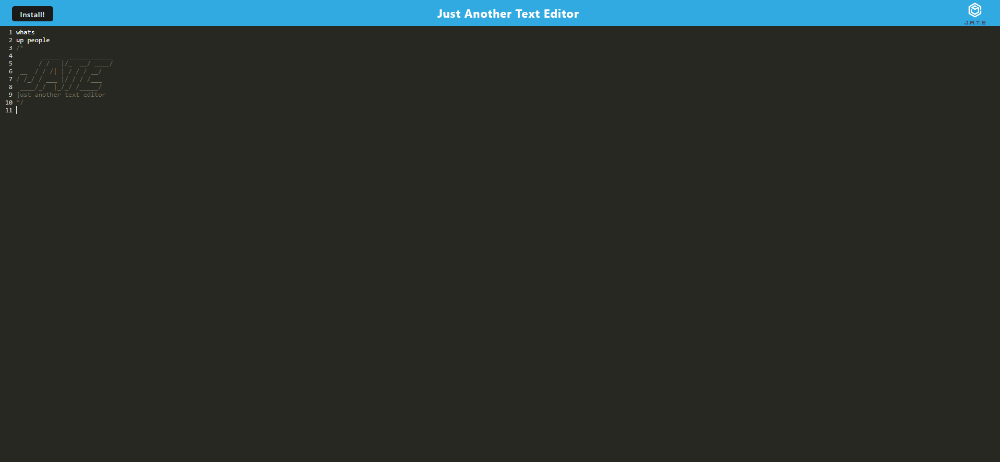

# Traughs-Text-Editor

## Table of Contents
1. [Description](#description)
2. [Visuals](#visuals)
3. [Resources](#resources)

## Description
- The app is a text editor that can still be accessed offline.
- The app will be a single-page application. 
- Additionally, it will feature a number of data persistence techniques that serve as redundancy in case one of the options is not supported by the browser. 
- The application will also function offline.

## Visuals

## Resources

[Repository](https://github.com/ntraugh/Traughs-Text-Editor)

[Live Site](https://desolate-beyond-84913.herokuapp.com/)